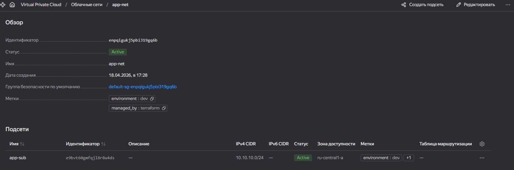
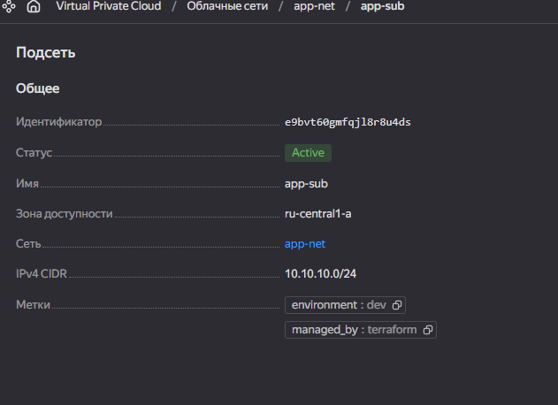
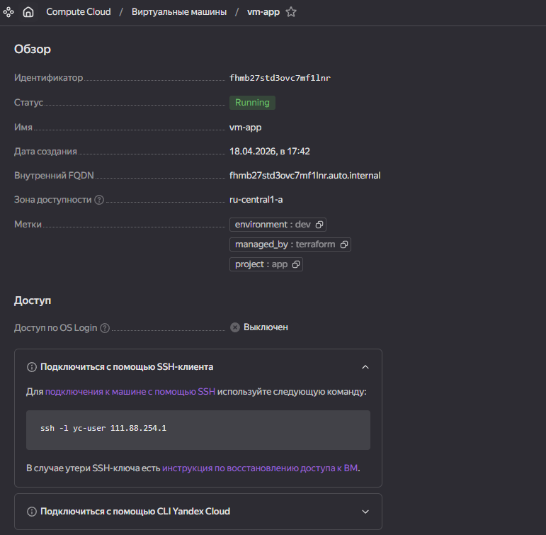
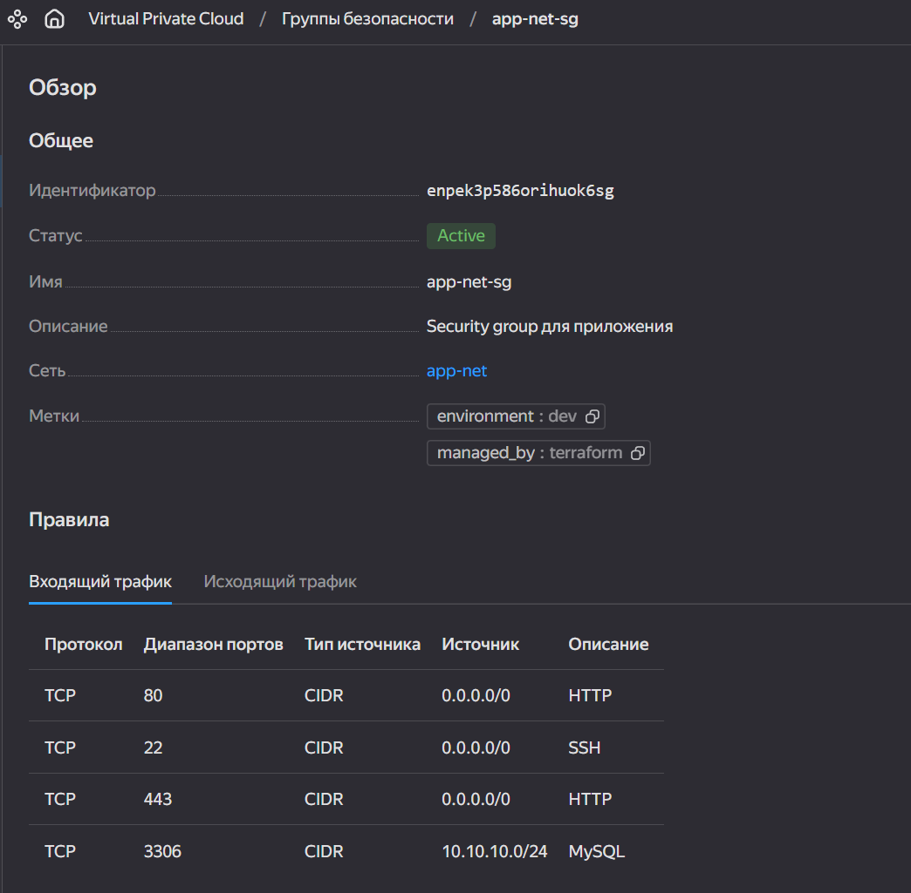
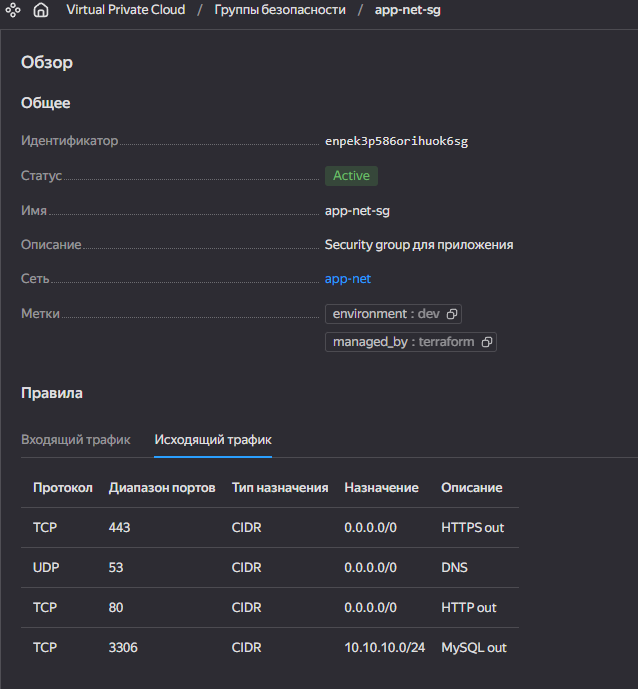
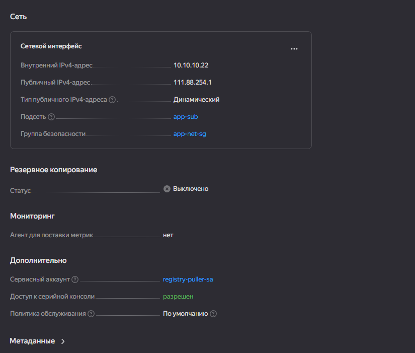

# Итоговый проект модуля «Облачная инфраструктура. Terraform»

#### Вводная информация
- [Структура проекта и Документация Terraform](docs/DIRECTORY_STRUCTURE.md)

#### Задание 1. Развертывание инфраструктуры в Yandex Cloud.

- Создание Virtual Private Cloud (VPC)

- Создание подсети

-  Создание виртуальные машины (VM):

        - Настройка группы безопасности (порты 22, 80, 443)

        - Привязываем группу безопасности к VM

- Описание создания БД MySQL в Yandex Cloud

- Описание создания Container Registry

#### Задание 2. Используя user-data (cloud-init), установливаем Docker и Docker Compose.

#### Задание 3. Описание Docker файла  c web-приложением и сохранние контейнера в Container Registry.

#### Задание 4. Завязываем работу приложения в контейнере на БД в Yandex Cloud.