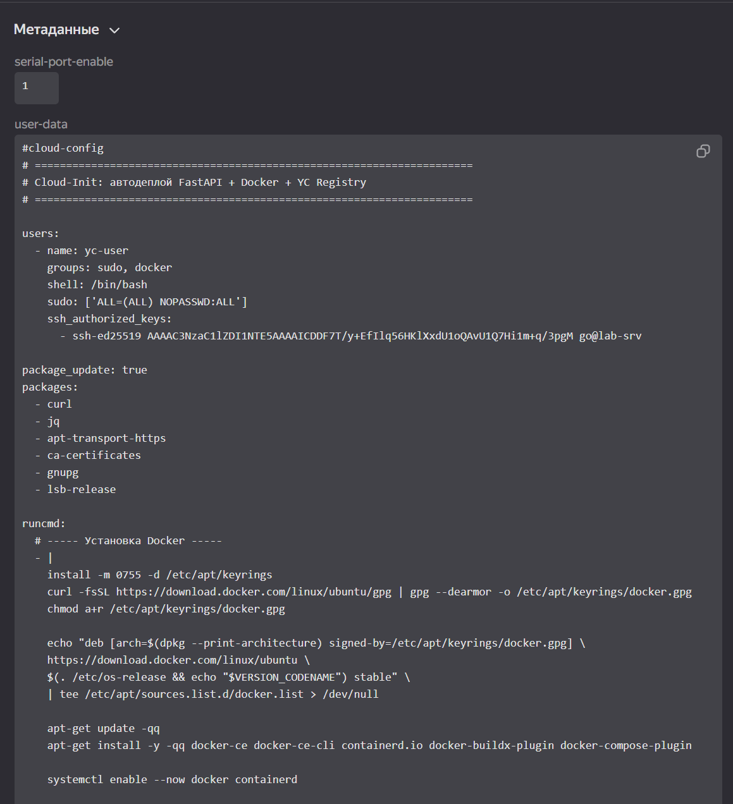
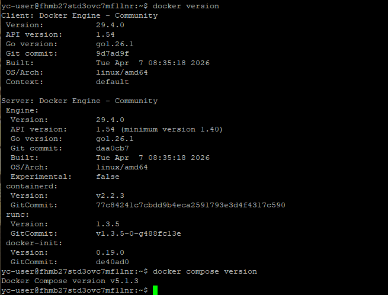
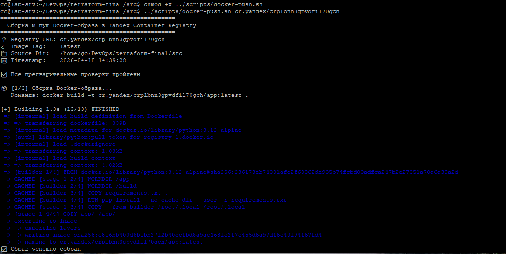
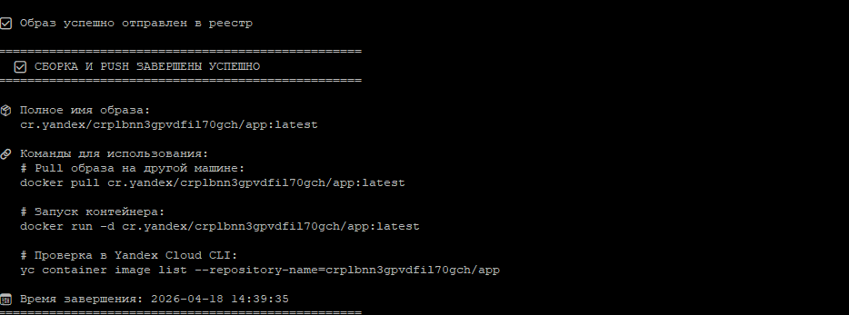
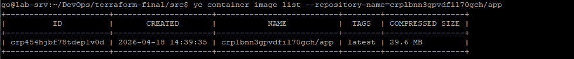
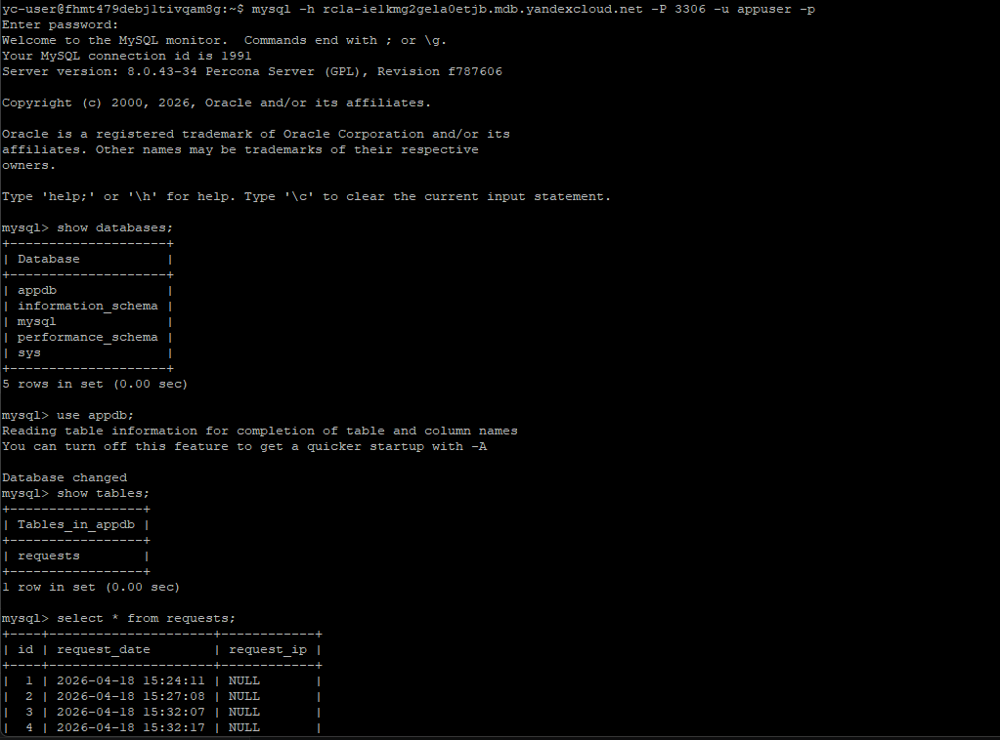

# Итоговый проект модуля «Облачная инфраструктура. Terraform»

#### Описание

Проект демонстрирует полный цикл развёртывания облачной инфраструктуры с использованием **Terraform**, **Docker** и **Yandex Cloud**.  
Реализовано:

- Создание VPC, подсети, группы безопасности.
- Управляемая база данных MySQL.
- Container Registry для хранения Docker-образов.
- Виртуальная машина с автоматической установкой Docker через `cloud-init`.
- Мультисборочный Dockerfile для Python FastAPI приложения.
- Интеграция приложения с БД.
- Удалённое хранение Terraform state в Object Storage.

#### Используемые технологии

- **Terraform** (≥1.12) — Infrastructure as Code
- **Yandex Cloud** — облачный провайдер
- **Docker & Docker Compose**
- **Python 3.12 + FastAPI + Uvicorn**
- **MySQL 8.0** (Managed Service for MySQL)
- **Yandex Container Registry**

#### Структура проекта 
- [Структура проекта и Документация Terraform](docs/DIRECTORY_STRUCTURE.md)

####  Инструкция по развёртыванию

###  Подготовка

- Установите [Terraform](https://developer.hashicorp.com/terraform/downloads) (≥1.12.0)
- Установите [Docker](https://docs.docker.com/get-docker/)
- Создайте сервисный аккаунт в Yandex Cloud с ролями `editor` и `container-registry.images.puller`
- Получите JSON‑ключ сервисного аккаунта и сохраните его, например, в `~/.config/yandex-cloud/sa-key.json`

### Настройка переменных

Скопируйте пример файла переменных и заполните его своими данными:

```bash
cd src
cp terraform.tfvars.example terraform.tfvars
```

### Для удалённого хранения Terraform state в Object Storage.

```
# Создание bucket
yc storage bucket create --name tf.state-bucket-xxxx --default-storage-class standard --public-read=false

# Создание service account
yc iam service-account create --name tf-bucket-sa

# Получение ID сервисного аккаунта
yc iam service-account get tf-bucket-sa

# Назначение роли
yc resource-manager folder add-access-binding <ID-каталога> --role editor --subject serviceAccount:<ID-аккаунта>

# Создание ключа доступа
yc iam access-key create --service-account-name tf-bucket-sa

# Пример вывода:
access_key:
  id: aje.........
  service_account_id: aje........
  created_at: "2026-04-17T13:56:02.451784022Z"
  key_id: XXXXXXXXXXXXXXXXXXXXX
secret: XXXXXXXXXXXXXXXXXXXXXXXXXXXXXXXXX

# Для дальнейшей работы:
export AWS_ACCESS_KEY_ID=<Ваш key_id>
export AWS_SECRET_ACCESS_KEY=<Ваш secret>

```

#### Задание 1. Развертывание инфраструктуры в Yandex Cloud.

- Создание Virtual Private Cloud (VPC)


- Создание подсети


- Создание виртуальные машины (VM):


   - Настройка группы безопасности (порты 22, 80, 443)


   - Привязываем группу безопасности к VM


- Описание создания БД MySQL в Yandex Cloud
   - База данных разворачивается с использованием **Yandex Managed Service for MySQL**. Вся конфигурация описана в модуле `modules/mysql/main.tf`.
   - [Основные компоненты](src/modules/mysql/README.md)
      - Параметры кластера:
         - **Имя**: `{environment}-mysql-cluster` (например, `prod-mysql-cluster`)
         - **Версия MySQL**: `8.0` (можно изменить на `8.4`)
         - **Ресурсы**: `s2.micro` (2 vCPU, 8 ГБ RAM), диск 20 ГБ (HDD)
         - **Окружение**: `PRODUCTION` (для `prod`) или `PRESTABLE` (для `staging`/`dev`)
         - **Хост**: размещается в той же зоне доступности и подсети, что и виртуальная машина
         - **Публичный IP**: отключён (`assign_public_ip = false`) — доступ только из внутренней сети
         - **Резервное копирование**: ежедневно в 03:00 UTC
      - Безопасность:
         - Кластер привязан к **группе безопасности**, которая разрешает входящий трафик на порт `3306` только с CIDR-блоков подсети приложения.
         - Пароль пользователя MySQL передаётся через защищённую переменную Terraform (`sensitive = true`) и не сохраняется в открытом виде в коде.
         - Включена защита от случайного удаления (`prevent_destroy = true`).
      - Конфигурация MySQL:
          ```hcl
                mysql_config = {
                innodb_buffer_pool_size = 1073741824   # 1 ГБ
                max_connections         = 100
                sql_mode                = "STRICT_TRANS_TABLES,NO_ZERO_IN_DATE,NO_ZERO_DATE,ERROR_FOR_DIVISION_BY_ZERO,NO_ENGINE_SUBSTITUTION"
                }
          ```      


- Описание создания Container Registry
    - Для хранения Docker-образов приложения в проекте используется **Yandex Container Registry**. Создание реестра описано в модуле `modules/registry/main.tf`.
    - [Основные компоненты](src/modules/registry/README.md)
    - Параметры реестра:
    ```hcl
                resource "yandex_container_registry" "registry" {
                  name      = var.name              # Имя реестра (например, "app-registry")
                        folder_id = var.folder_id         # ID каталога Yandex Cloud

                labels = {
                environment = var.environment   # prod / staging / dev
                managed_by  = "terraform"       # Метка для идентификации управления
                        }
                }
                
#### Задание 2. Используя user-data (cloud-init), установливаем Docker и Docker Compose.
[cloud-init](src/modules/vm/cloud-init.yaml.tpl)




#### Задание 3. Описание Docker файла  c web-приложением и сохранние контейнера в Container Registry.
- [Docker file](src/Dockerfile)

- [Файл зависимостей requirements.txt](src/requirements.txt)

- [Cохранние контейнера в Container Registry](scripts/docker-push.sh)

```../scripts/docker-push.sh $(terraform output -raw registry_url) latest```





#### Задание 4. Завязываем работу приложения в контейнере на БД в Yandex Cloud.
- [Docker-compose.yml](src/docker-compose.yml)
- Проверка соединения с БД и работы web-приложения
Смотрим FQDN mysql сервера ```terraform output mysql_connection_string```
Подключаемся к ВМ по ssh (```ssh -l yc-user $(terraform output -raw vm_external_ip)```)
смотрим работу сервиса app.service ``` sudo systemctl status app.service```
через mysql-client (```sudo apt install mysql-client```) проверяем соединение с БД
```mysql -h rc1a-ie1kmg2gela0etjb.mdb.yandexcloud.net -P 3306 -u appuser -p```

